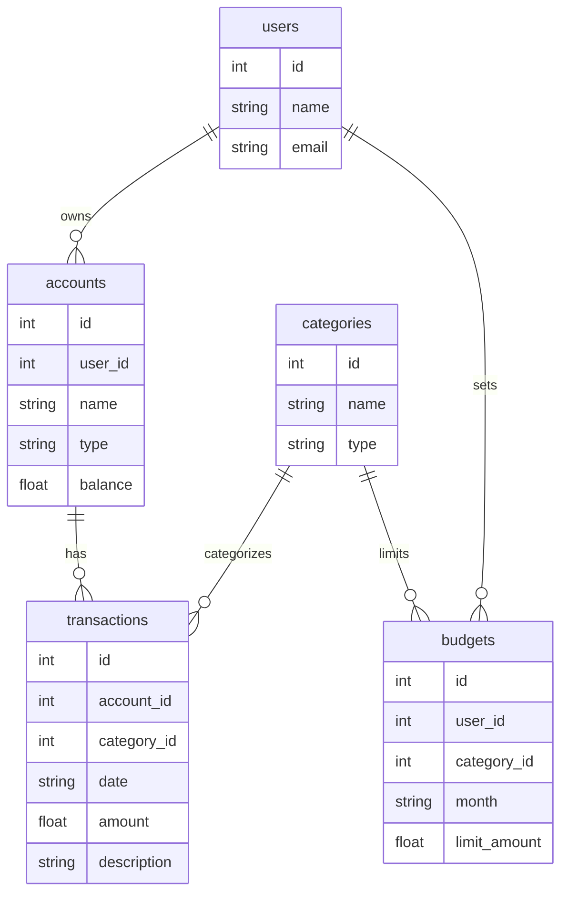

# 💰 Personal Budget Tracker

A lightweight, SQLite-powered personal finance tracker built with Python. This tool allows users to track income, expenses, and budgets across multiple accounts and categories.

---

## 🚀 Features

- Multi-user support
- Multiple accounts per user (e.g., Checking, Credit Card)
- Income and expense tracking with descriptions and dates
- Category-based budget limits per month
- SQL-powered queries for insights

---

## 🗂️ Project Files

```
budget-tracker/
├── budget_tracker.db     # SQLite database (generated)
├── schema.py             # Creates tables and inserts sample data
├── query.py              # Executes queries to extract insights
└── README.md             # Documentation (this file)
```

---

## 📦 Requirements

- Python 3.x

No external libraries are required. Uses only the built-in `sqlite3` module.

---

## ⚙️ How to Run

1. Run the schema script to create and populate the database:

   ```bash
   python schema.py
   ```

2. Run the query script to display analytics and reports:

   ```bash
   python query.py
   ```

---

## 🧱 Database Schema

### Entity-Relationship Diagram

> This diagram is written in Mermaid syntax. If you're viewing on GitHub, use a Mermaid-compatible viewer like [HackMD](https://hackmd.io/) or VS Code with a Mermaid extension to see the rendered version.



---

## 🧪 Query Examples

**View Alice's transactions:**
```sql
SELECT date, amount, description FROM transactions
WHERE account_id IN (SELECT id FROM accounts WHERE user_id = 1);
```

**Sum expenses by category (May 2025):**
```sql
SELECT c.name, SUM(-t.amount) FROM transactions t
JOIN categories c ON t.category_id = c.id
WHERE c.type = 'Expense' AND strftime('%Y-%m', t.date) = '2025-05'
GROUP BY c.name;
```

**Compare budget vs actual:**
```sql
SELECT c.name, b.limit_amount, SUM(-t.amount)
FROM budgets b
JOIN categories c ON b.category_id = c.id
LEFT JOIN transactions t ON t.category_id = c.id
  AND strftime('%Y-%m', t.date) = b.month
GROUP BY c.name, b.limit_amount;
```

---

## 📂 Data Sources

All data (users, accounts, categories, etc.) was **generated manually** within `schema.py` for demonstration purposes.

---

## 🧠 Design Decisions

- Normalized relational schema
- Easy-to-query structure for budget tracking
- No external data dependencies
- Focused on teaching core SQL relationships and analysis

---

## 📚 License & Credit

Project developed as part of **CS50 SQL Final Project – May 2025**.  
Developed by: Sayqin Rustamli and Erleta Mziu

---

*Happy budgeting!* 💸
